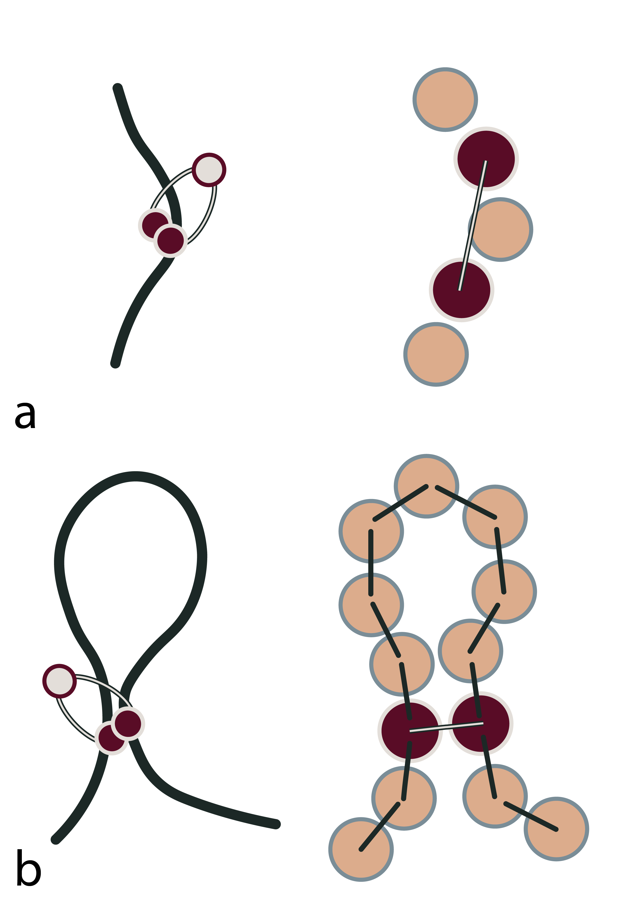
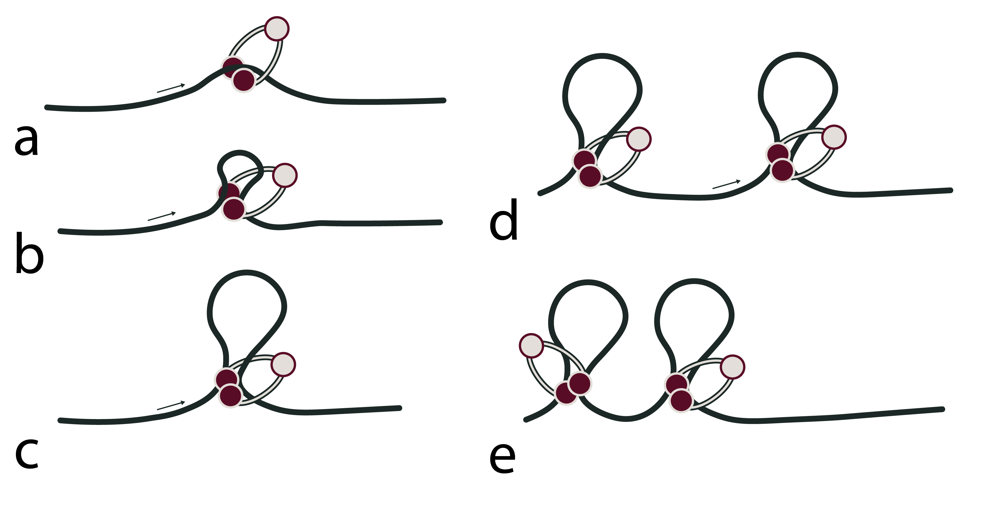
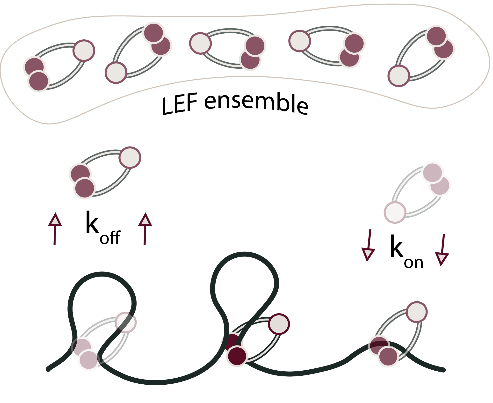

# SMC Fix for LAMMPS: Loop Extrusion and Protein Bridging in LAMMPS

## Introduction 
This repository contains code for implementing Loop Extruding Factor (LEF/SMC) proteins with optional bridging activity in LAMMPS (Large-scale Atomic/Molecular Massively Parallel Simulator). The code models the dynamics of SMC complexes on DNA polymers, including loop extrusion, loading/unloading kinetics, and inter-polymer bridging through patch interactions.

The detailed physical implementation and validation is described in [1](https://doi.org/10.1103/PhysRevResearch.6.033160) and [2](https://arxiv.org/abs/2506.04060). Development started in 11/22 and currently supports LAMMPS (29 Aug 2024 - Update 1).

## Loop Extrusion Algorithm

### Overview
Loop extrusion is the process where an SMC protein holds two DNA sites (anchor and hinge beads) through bonds and moves along the polymer by releasing one end and binding a new end ahead. The algorithm models this as a Monte Carlo process with geometric constraints and probabilistic kinetics.

### Initialization Phase (Timestep 1)



*Figure: Schematic showing SMC anchor and hinge on the polymer at the first timestep (a) and later timesteps (b)*

**Algorithm Steps**:
1. **Compile availability list**: Scan all polymer beads for valid SMC positions
   - Valid positions must be ≥2 beads away from polymer ends
   - No overlaps with other SMC anchor/hinge positions
   - Not on blocked bead types (e.g., crosslinks)
2. **Select initial positions** based on initmode:
   - **random**: Each SMC independently selects random valid position
   - **distributed**: First one SMC per polymer, then random for remainder
   - **full-distributed**: Even distribution across polymers using modulo assignment
   - **fixed**: Load from input file (no random selection)
3. **Create initial bonds**:
   - Anchor and hinge set 2 beads apart: hinge = anchor ± 2
   - FENE bond created with type smcbitype (initial bond identifier)
   - Atom types changed: anchor → smctype, hinge → smctype+2
4. **MPI synchronization**:
   - All processors broadcast anchor/hinge positions from rank-0
   - Barriers ensure consistent state across parallel processors

### Dynamics Phase (Every nevery Timesteps)



*Figure: Schematic showing SMC extrusion (a-c), and extrusion stopping because of boundary conditions (d) or encountering another SMC (e)*

**Main Loop Structure**:
```
For each timestep divisible by nevery:
  For each SMC i in the system:
    1. Check loading condition (if not yet loaded)
    2. Check probability for movement
    3. If movement accepted:
       a. Propose new position
       b. Validate geometry and contacts
       c. Execute movement (old bond removed, new bond created)
    4. Check unloading condition
    5. Log state (if debug enabled)
```

**Loading Phase** (if kon probability triggers):
1. Compile current availability list via compile_avl_list()
2. MPI reduction ensures all processors see same available positions
3. Rank-0 selects random available position
4. All processors receive via MPI_Bcast
5. place_smc() activates SMC: type changes, bonds created
6. Special neighbor lists rebuilt for affected atoms

**Movement Phase** (if movement probability triggered):
1. **Direction selection** (based on dirmode):
   - **Bidirectional**: Randomly choose which end moves (anchor or hinge)
   - **Monodirectional (mono1/mono2)**: Only hinge moves, direction fixed
   - **Alternating**: Switch between mono1 and mono2 per timestep
2. **Propose new position**:
   - Candidate = current_position ± direction (±1 or ±2)
   - Check polymer boundary conditions:
     * Linear: new_pos must be in [1, lpol]
     * Ring: new_pos wraps around: if >lpol then wrap, if <1 then wrap
3. **Validate proposed movement**:
   - **Distance check**: Compute Cartesian distance between new anchor and hinge
     * Uses compute_xyz() for MPI-reduced coordinate retrieval
     * Handles periodic boundary unwrapping via domain->unmap()
     * Rejects if distance > cutoff (prevents over-stretching)
   - **Angle/tangent check**: Compute dot product of tangent vectors
     * Tangent = next_bead - current_bead (direction of polymer)
     * Rejects if |tangent_dot_product| > tancoff
     * Prevents SMCs from binding beads at wrong angles
   - **Collision check**: Verify no other SMC occupies proposed positions
     * Check new anchor position against all other SMC anchors/hinges
     * Check new hinge position similarly
     * Reject if overlap detected
   - **Blocked bead check**: Verify beads are not forbidden types
     * MPI_Allreduce ensures all processors agree
4. **Execute movement** (if all validations pass):
   - remove_smc() at old position: removes bonds, resets types
   - Shift position: anch[i] = proposed_anchor, hing[i] = proposed_hinge
   - place_smc() at new position: creates new bonds, changes types
   - update_topology() rebuilds special lists
   - debug_post() logs success/failure with metrics
5. **Error tracking**:
   - err1: Probability rejection
   - err2: Collision with other SMC
   - err3: Blocked bead type encountered
   - err4: Distance too large
   - err5: Angle/tangent constraint violated



*Figure: Dynamic loading and unloading of SMCs*

**Unloading Phase** (if koff probability triggers):
1. Check random number < koff
2. If triggered:
   - remove_smc() at current position
   - Set anchor[i] = -1, hing[i] = -1 (mark as unloaded)
   - Decrement active SMC counter
3. Unloaded SMCs available for reloading via loading phase

## Debug Output

When debug flag enabled, fix_smc outputs CSV log (log_fix_smc.txt):
```
timestep, processor_rank, smc_index, anchor_tag, anchor_type_pre,
hinge_tag, hinge_type_pre, anchor_tag, anchor_type_post, 
hinge_tag, hinge_type_post, err1, err2, err3, err4, err5, distance, tangent
```

Allows post-processing analysis of:
- Movement success/failure reasons
- Type state transitions
- Distance and angle metrics
- Per-processor SMC behavior

### SMC Bridging

The fix supports the implementation of protein bridging upon loop extrusion by either:

1. Introduction of "sticky patches" upon beads belonging to DNA molecules:
   - Fix SMC support this option through the parameter *npatches*, allowing correct calculation of SMC movements while the bridging interaction is implemented in LAMMPS
2. Introduction of transient bonds between SMC beads or SMC and DNA beads:
    - Fix SMC supports this option through *fix_bond_creat_bridg* module that consists in a tweaked version of *fix_bond_create* only allowing bond creation if the selected bead is not a 1-1, 1-2 or 1-3 neighbour to avoid error in the simulation.


# How to run Fix SMC

The fix implements loop extrusion dynamics as described in the algorithms above. Add the following command to a LAMMPS input script:

```
fix <fixname> <group> smc <nevery> <seed> <prob> <lpol> <poltype> <maxadir> <maxhdir> <smcnum> <smctype> <smcbtype> <smcbitype> <cutoff> <tancoff> <initmode> <kon> <koff> [debug] [fixFname] [blockbeads]
```

### Parameter Descriptions

**Timing and Random Number Generation**:
1. **nevery**: Frequency of SMC movement attempts (timesteps)
   - Movement, loading, and unloading checks occur every nevery steps
   - Smaller values = faster extrusion speed (more attempts)
   - Typical: 10-100
2. **seed**: Random number generator seed for reproducibility
   - Different seeds give different SMC trajectories
   - Same seed produces identical results

**Movement Dynamics** (controls loop extrusion kinematics):
3. **prob**: Probability of accepting proposed movement (0.0-1.0)
   - Controls effective extrusion speed: v_eff = v_max × prob
   - prob=1.0: accept all geometrically valid movements
   - prob<1.0: stochastically reject valid movements
4. **maxadir**: Direction parameter for anchor movement
   - If maxadir > 0: anchor moves toward higher bead indices
   - If maxadir < 0: anchor moves toward lower bead indices
   - |maxadir| typically 1 or 2 (base pairs per step)
5. **maxhdir**: Direction parameter for hinge movement
   - If maxhdir > 0: hinge moves toward higher indices
   - If maxhdir < 0: hinge moves toward lower indices
   - For bidirectional: maxadir and maxhdir should be opposite signs

**System Configuration** (DNA and SMC setup):
6. **lpol**: Length of polymer in simulation (number of beads)
7. **poltype**: Polymer topology
   - "linear": Open chain, SMCs cannot wrap around ends
   - "ring": Circular DNA, SMCs can extrude beyond nominal boundary
8. **smcnum**: Number of SMC proteins deployed

**Bond and Type Management**:
1. **smctype**: Atom type assigned to SMC anchor/hinge beads
   - Anchors set to smctype
   - Hinges set to smctype+2
   - Patch atoms colored by smctype+1 and smctype+3
2.  **smcbtype**: Bond type after first movement (moving SMC bonds)
    - Bonds created during movement use this type
    - Allows distinguishing initial vs. moving bonds in post-processing
3.  **smcbitype**: Bond type at initial deployment
    - Bonds created during initialization use this type
    - Typically smcbitype < smcbtype for tracking

**Geometric Constraints** (prevent unphysical configurations):
12. **cutoff**: Maximum distance between anchor and hinge
    - Prevents over-stretching: |r_hinge - r_anchor| < cutoff × σ
    - Typical: 1.2-1.5 (in simulation units)
    - Physical interpretation: maximum loop length
13. **tancoff**: Tangent/angle constraint
    - Scalar product of polymer tangent vectors must be < tancoff

**Loading and Unloading** (SMC kinetics):
1.  **initmode**: Initialization strategy for SMC placement
    - "random": Each SMC independently selects random valid position
    - "distributed": First place one per polymer, then random for rest
    - "full-distributed": Even distribution: SMC i goes to polymer floor(i×npol/nsmc)
    - "fixed": Load positions from file (specified by fixFname)
2.  **kon**: Loading probability per nevery interval
    - Probability that unloaded SMC becomes active
    - Range: 0.0 (never load) to 1.0 (always load)

3.  **koff**: Unloading probability per nevery interval
    - Probability that loaded SMC becomes inactive
    - Range: 0.0 (never unload) to 1.0 (always unload)
    - Effective rate: k_off = koff / (nevery × dt) in physical units

**Optional Parameters**:
1.  **debug**: Debugging flag (optional)
    - Any non-zero value enables CSV logging to log_fix_smc.txt
    - Logs every SMC movement with state and error information

2.  **fixFname**: Initial position file (optional, required for initmode="fixed")
    - Text file with two columns: anchor_bead hinge_bead
    - One SMC per line, space-separated
    - Example:
      ```
      10 12
      25 27
      40 42
      ```
3.  **blockbeads**: Forbidden bead types (optional)
    - Space-separated list of atom types SMCs cannot bind
    - Example: `5 6` prevents binding to types 5 and 6

### Example Commands

**Simple bidirectional loop extrusion** (prob=1.0):
```
fix extrude all smc 10 12345 1.0 100 linear 1 -1 10 3 2 1 1.2 0.5 random 0.1 0.005
```
- 100 beads polymer
- 10 SMCs
- Move every 10 steps
- Try prob=100%

**Monodirectional slow extrusion** (prob=0.2, directional):
```
fix extrude all smc 50 54321 0.2 50 ring 1 0 5 3 2 1 1.3 0.4 distributed 0.05 0.002
```
- 50 beads ring polymer
- 5 SMCs distributed
- Move every 50 steps with 20% acceptance
- Ring topology allows wrapping

# How to run Fix SMC Dump

An additional fix (`fix_dumpsmc`) was developed to periodically dump SMC endpoint positions to a file. This is useful for trajectory analysis and visualization. Use:

```
fix <dumpname> <group> dumpsmc <nevery> <nsmc> <filename> <smc_fixname>
```

### Parameter Descriptions

1. **nevery**: Dump frequency (timesteps)
   - Smaller values = more frequent output, larger files
   - Typical: 100-1000
2. **nsmc**: Number of SMCs in corresponding fix smc
   - Must match nsmc in the fix smc command
3. **filename**: Output file name
   - CSV format: one line per dump event
   - Columns: timestep, smc_index, left_anchor_pos, left_hinge_pos, right_anchor_pos, right_hinge_pos
4. **smc_fixname**: Name of the fix smc to read from
   - Must match the fix name in fix smc command

## Limitations and Warnings

### Current Status

1. **Deployment timing**: SMCs are all deployed together at timestep 1
   - Cannot add new SMCs during simulation
2. **Monodisperse requirement**: Loop extrusion requires uniform polymer length
   - Systems with different polymer sizes not supported

### Known Issues and Constraints

1. **Polymer topology**:
   - Ring polymers must have sufficient length (≥4 beads)
   - Linear polymers cannot place SMCs within 1 bead of ends
   - Extremely short polymers may have zero valid positions

2. **Parameter coupling**:
   - Cutoff and tancoff must be realistic for given polymer (see algorithm section)
   - Too restrictive (small cutoff/tancoff) → frequent rejections
   - Too permissive (large cutoff/tancoff) → unphysical configurations

3. **Bond dynamics**:
   - FENE bond breaking can occur if extension exceeds R₀=1.7σ
   - Harmon bond during initialization (first step) may cause thermostat issues

## Code Structure

### Main Functions

- **fix_smc.cpp**: Core loop extrusion implementation
  - `post_integrate()`: Main dynamics loop (loading/movement/unloading)
  - `compile_avl_list()`: Available position search with MPI reduction
  - `place_smc()`: Activate SMC (type changes, bond creation)
  - `remove_smc()`: Deactivate SMC (type reset, bond removal)
  - See src/fix_smc.cpp for detailed algorithm documentation

- **fix_dumpsmc.cpp**: SMC trajectory output
  - `post_integrate()`: Periodic position dumping
  - Handles both local and remote SMC coordinate retrieval

- **fix_bond_create_bridg.cpp**: Custom bond creation with topology management
  - `post_integrate()`: Partner selection for patch hybridization
  - `rebuild_special_one()`: Special list reconstruction after bonding
  - See src/fix_bond_create_bridg.cpp for neighbor list management

### Compilation

Requires LAMMPS source with C++11 and MPI support:

```bash
# Add files to LAMMPS src/
cp src/*.cpp /path/to/lammps/src/
cp src/*.h /path/to/lammps/src/

# Recompile LAMMPS
cd /path/to/lammps/src
make serial  # or make mpi for parallel
```

## Contact and Support

For issues, questions, or contributions:
- Check log_fix_smc.txt for movement rejection reasons
- Verify parameter ranges against algorithms section
- Test with simple systems before scaling to production runs
- See function documentation in src/ files for detailed step-by-step explanations